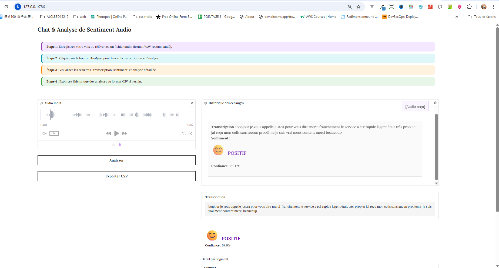
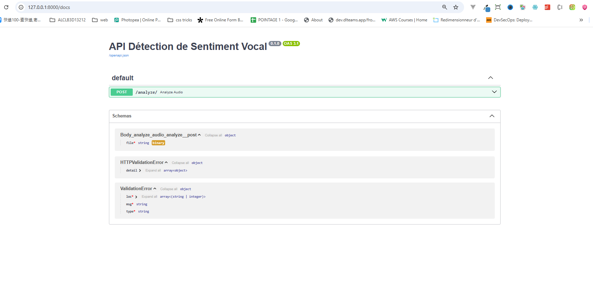

# Sentiment Audio

Ce projet propose un pipeline complet d’analyse de sentiment à partir de fichiers audio francophones, structuré en quatre composantes principales :

1. **Transcription audio**  
   - Modèle Wav2Vec2 (`jonatasgrosman/wav2vec2-large-xlsr-53-french`)  
   - Extraction de vecteurs audio puis décodage CTC
   
2. **Analyse de sentiment textuel**  
   - Modèle BERT multilingue (`nlptown/bert-base-multilingual-uncased-sentiment`)  
   - Fonction `analyze_sentiment(text)` retournant un label (`négatif`, `neutre`, `positif`) et sa confiance
   
3. **Interface utilisateur Gradio**  
   - Modes d’entrée : **enregistrement microphone** et **téléversement de fichier**  
   - Affichage de la transcription et du score de sentiment en temps réel  
   

4. **API REST FastAPI**  
   - Endpoint `/predict` pour soumettre un fichier audio  
   - Retour JSON `{ "transcription": ..., "sentiment": {label: confiance} }`  
   - Documentation interactive Swagger UI (`/docs`)  
   

---

## Structure du projet

```
sentiment_audio_tp/
├── hf_model/              # exports de modèles sauvegardés via save_pretrained
├── models/                # cache local HuggingFace (ignoré par Git)
├── src/
│   ├── __init__.py
│   ├── transcription.py   # SpeechEncoder (Wav2Vec2Model)
│   ├── sentiment.py       # TextEncoder + analyze_sentiment()
│   ├── multimodal.py      # Classifieur multimodal (fusion embeddings)
│   ├── inference.py       # CLI (audio → transcription + sentiment)
│   ├── app.py             # Interface Gradio
│   └── api.py             # Serveur FastAPI
├── requirements.txt       # Dépendances du projet
├── render.yaml            # Infra as code pour Render
└── README.md              # Ce document
```

---

## Installation

1. **Cloner le dépôt**  
   ```bash
   git clone <URL_DU_REPO>
   cd sentiment_audio_tp
   ```

2. **Configurer l’environnement**  
   ```bash
   python -m venv venv
   source venv/bin/activate   # macOS/Linux
   .\venv\Scripts\Activate.ps1  # Windows PowerShell
   ```

3. **Installer les dépendances**  
   ```bash
   pip install --upgrade pip
   pip install -r requirements.txt
   ```

---

## Utilisation

### CLI d’inférence

```bash
python src/inference.py chemin/vers/audio.wav
# Affiche la transcription et le résultat de sentiment
```

### Interface Gradio

```bash
python -m src.app
```

- Rendez-vous sur `http://127.0.0.1:7861/`  
- Choisissez **Enregistrement** ou **Upload**  
- Obtenez la transcription et le sentiment en temps réel

### API REST

```bash
uvicorn src.api:app --reload --host 0.0.0.0 --port 8000
```

- Swagger UI : `http://127.0.0.1:8000/docs`  
- Tester avec `curl` ou Postman :

  ```bash
  curl -X POST "http://127.0.0.1:8000/predict" \
       -F "file=@/chemin/vers/audio.wav"
  ```

---

## Cas d’usage

- **Prototype rapide** d’analyse de sentiment sur des appels clients, podcasts, interviews  
- **Outil de validation** pour analyses qualitatives de contenu audio  
- **Proof of Concept** pour architectures multimodales  
- **Service back-end** dans un chatbot vocal ou plateforme d’assistance

---

## Extension

- **Fine-tuning multimodal** : entraînement du classifieur fusion sur un dataset annoté  
- **Support de nouveaux formats** : MP3, FLAC…  
- **Tests et CI** : ajouter des tests `pytest` et pipelines CI/CD  
- **Déploiement** : Docker, Kubernetes, monitoring

---

## Licence

Licence **MIT** — libre d’utilisation, modification et redistribution.
```
